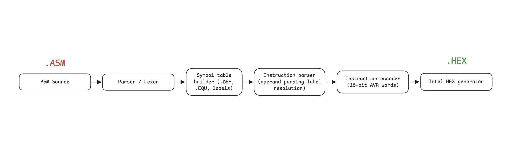

# AVR Compiler (TypeScript)
This project is a simple AVR assembler/compiler written in TypeScript. It parses assembly source code, resolves labels and symbols, encodes AVR instructions, and generates an Intel HEX output file.

The compiler is designed with a future web migration in mind: the implementation is already written in TypeScript so it can be adapted to run in the browser and provide a web-based compiler experience without installing anything.

## What it does

- Reads an AVR assembly file from `./asm/main.asm`
- Builds symbol and label tables from `.DEF`, `.EQU`, and label definitions
- Parses instruction lines and operand tokens
- Validates instruction operands and ranges
- Encodes instructions into 16-bit AVR words
- Generates Intel HEX output at `./output/main.hex`

## Compilation Flow

## Key components

- `encoder.ts`: Encodes instruction definitions into binary machine code
- `generator.ts`: Converts encoded words into Intel HEX format
- `index.ts`: Main compiler flow that reads assembly, processes symbols/labels, encodes instructions, and writes output
- `instructions.ts`: Instruction definitions for AVR opcodes like `LDI` and `RJMP`
- `ISA.ts`: Instruction set abstraction and contextual parser injection for labels and symbols
- `labels.ts`: Label detection and address resolution
- `parsers.ts`: Operand parsing for registers, numbers, and symbolic references
- `symbols.ts`: Symbol table builder for assembler directives
- `types.ts`: Shared type definitions for instructions, operands, symbols, and labels

## Usage

1. Add your AVR assembly source to `./asm/main.asm`
2. Run the compiler with Node.js and TypeScript support
3. The output file will be written to `./output/main.hex`

## Future web migration

This compiler was built in TypeScript intentionally so it can be migrated to a browser environment. The goal is to create a web-based AVR compiler that runs entirely client-side, allowing users to assemble code directly in the browser without installing any development tools.

## Why TypeScript?

- Strong typing improves maintainability and reduces parser/encoder errors
- Easier migration to web frameworks like Vite, React, or plain browser bundlers
- Keeps parsing, symbol handling, and output generation modular and reusable

## Notes

- Current implementation supports a minimal AVR instruction subset.
- The architecture supports adding more instructions and directives over time.
- The web version can reuse the same parser and encoder logic with minor adaptation.